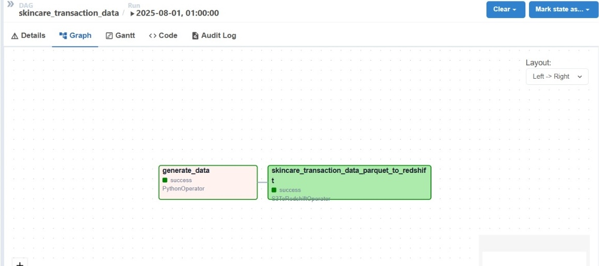

# Daily Skincare Transactions Pipeline

## Overview
This solution generates up to 1 million skincare transactions daily, stores them in S3 as Parquet files, and loads them into Amazon Redshift via Airflow.

---

## Components

# 1. Data Generator
- Uses `faker` and `random` to simulate transactions.
- Generates between **500K - 1M** records daily.
- Saves files as `YYYY-MM-DD_tranx.parquet` in an S3 data lake.

## 2. Airflow DAG
- Runs daily.
- Transfers data from S3 to Redshift using `S3ToRedshiftOperator`.

### 3. Infrastructure
- **SET VPC** with:
  - Public & private subnets
  - NAT Gateway
  - Redshift subnet group
  - VPC endpoint for S3 access
  - Redshift runs in **private subnets** with secure routing.
  - Airflow has IAM permissions.

---

## Setup

- Airflow instance with AWS & Redshift connections set
- S3 bucket: `joy-skincare-daily-transaction-data`
- Redshift table `public.skincare_transactions` 

### Steps
1. Deploy VPC with Redshift & S3 endpoint.
2. Upload `transaction_generator.py` to your Airflow DAGs folder.
3. Upload `airflow_dag.py` to Airflow.
4. Add Airflow variables `ACCESS_KEY` and `SECRET_KEY`.
5. Trigger the DAG 
6. Data is transferred securely via S3 endpoint and VPC.
7. IAM credentials are securely managed via Airflow Variables.

---

